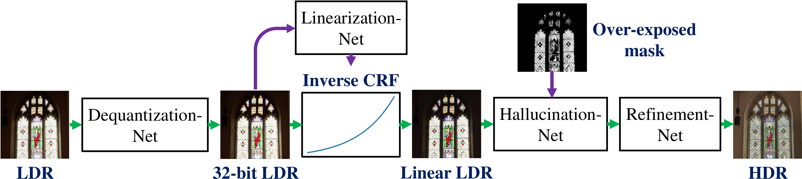

## Important update (2020/07/10)
The webpage and the links to the dataset will not be accessible from 7/7 to 7/25. The temporary links to the dataset are below:

[Training data ](https://drive.google.com/file/d/1muy49Pd0c7ZkxyxoxV7vIRvPv6kJdPR2/view?usp=sharing)

[Testing data (HDR-Synth)](https://drive.google.com/file/d/1m4CVsxAy4sXD1IlhPi1Tfi9pqiuhly3L/view?usp=sharing)

[Testing data (HDR-Real)](https://drive.google.com/file/d/1aHm55zFrPoRu2KwhSnzqbsUNsapStrlC/view?usp=sharing)

[Testing data (RAISE)](https://drive.google.com/file/d/1rl3BSQ0Oyx-qCfpVCH4kVxaidrR01EZ7/view?usp=sharing)

[Testing data (HDR-Eye)](https://drive.google.com/file/d/1l-Ix-7qQQqRjAOU6ow9UK-glooaWJ5_Y/view?usp=sharing)

Sorry for the inconvenience.

# [CVPR 2020] Single-Image HDR Reconstruction by Learning to Reverse the Camera Pipeline


Recovering a high dynamic range (HDR) image from asingle low dynamic range (LDR) input image is challenging due to missing details in under-/over-exposed regions caused by quantization and saturation of camera sensors. In contrast to existing learning-based methods, our core idea is to incorporate the domain knowledge of the LDR image formation pipeline into our model. We model the HDR-to-LDR image formation pipeline as the (1) dynamic range clipping, (2) non-linear mapping from a camera response function, and (3) quantization. We then propose to learn three specialized CNNs to reverse these steps. By decomposing the problem into specific sub-tasks, we impose effective physical constraints to facilitate the training of individual sub-networks. Finally, we jointly fine-tune the entire model end-to-end to reduce error accumulation. With extensive quantitative and qualitative experiments on diverse image datasets, we demonstrate that the proposed method performs favorably against state-of-the-art single-image HDR reconstruction algorithms. The source code, datasets, and pre-trained model are available at our project website.

[[Project]](https://www.cmlab.csie.ntu.edu.tw/~yulunliu/SingleHDR) 

Paper

<a href="https://arxiv.org/abs/2004.01179" rel="Paper"></a>

## Overview
This is the author's reference implementation of the single-image HDR reconstruction using TensorFlow described in:
"Single-Image HDR Reconstruction by Learning to Reverse the Camera Pipeline"
[Yu-Lun Liu](http://www.cmlab.csie.ntu.edu.tw/~yulunliu/), [Wei-Sheng Lai](https://www.wslai.net/), [Yu-Sheng Chen](https://www.cmlab.csie.ntu.edu.tw/~nothinglo/), Yi-Lung Kao, [Ming-Hsuan Yang](https://faculty.ucmerced.edu/mhyang/), [Yung-Yu Chuang](https://www.csie.ntu.edu.tw/~cyy/), [Jia-Bin Huang](https://filebox.ece.vt.edu/~jbhuang/) (National Taiwan University & Google & Virginia Tech & University of California at Merced & MediaTek Inc.)
in CVPR 2020.
If you find this code useful for your research, please consider citing the following paper.



Further information please contact [Yu-Lun Liu](http://www.cmlab.csie.ntu.edu.tw/~yulunliu/).

## Requirements setup
* [TensorFlow](https://www.tensorflow.org/)

    * tested using TensorFlow 1.10.0

* To download the pre-trained models:

    * [ckpt](https://www.cmlab.csie.ntu.edu.tw/~yulunliu/SingleHDR_/ckpt.zip)

## Usage
* Run your own images (using the model trained on our synthetic training data):
``` bash
CUDA_VISIBLEDEVICES=0 python3 test_real.py --ckpt_path_deq ckpt_deq/model.ckpt --ckpt_path_lin ckpt_lin/model.ckpt --ckpt_path_hal ckpt_hal/model.ckpt --test_imgs ./imgs --output_path output_hdrs
```

* Run your own images (using the model fine-tuned on both synthetic and real training data):
``` bash
CUDA_VISIBLEDEVICES=0 python3 test_real_refinement.py --ckpt_path ckpt_deq_lin_hal_ref/model.ckpt --test_imgs ./imgs --output_path output_hdrs
```

## Citation
```
[1] Yu-Lun Liu, Wei-Sheng Lai, Yu-Sheng Chen, Yi-Lung Kao, Ming-Hsuan Yang, Yung-Yu Chuang, and Jia-Bin Huang. Single-Image HDR Reconstruction by Learning to Reverse the Camera Pipeline. Proceedings of IEEE Conference on Computer Vision and Pattern Recognition (CVPR), 2020
```
```
[2] Gabriel Eilertsen, Joel Kronander, Gyorgy Denes, Rafa\l Mantiuk, and Jonas Unger. HDR image reconstruction from a single exposure using deep CNNs. ACM Transactions on Graphics (TOG), 2017
```

## Acknowledgment
Parts of the code in ```hallucination_net.py``` are folked from [HDRCNN](https://github.com/gabrieleilertsen/hdrcnn). 
